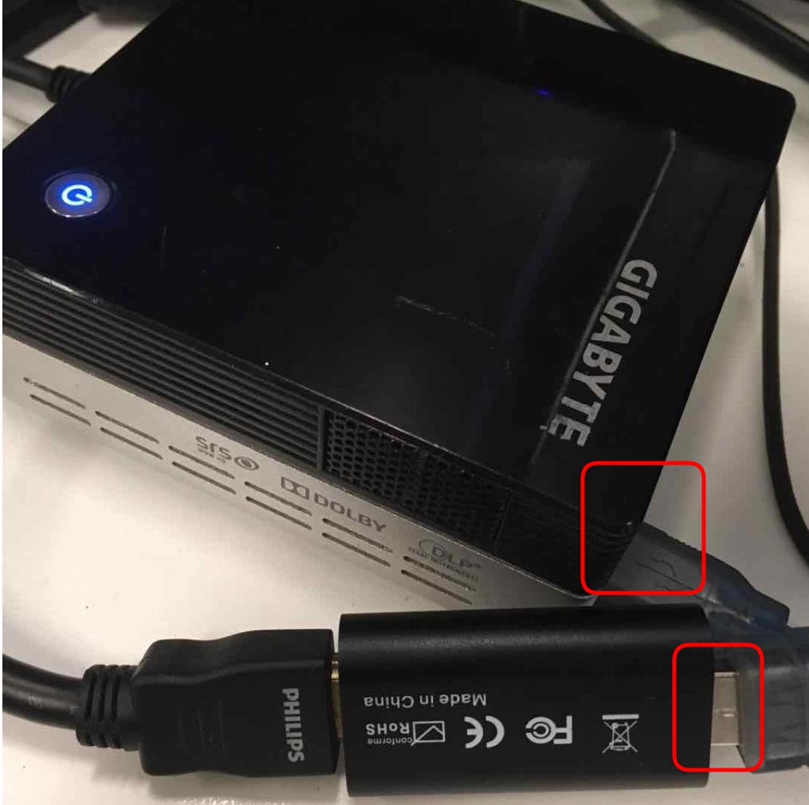
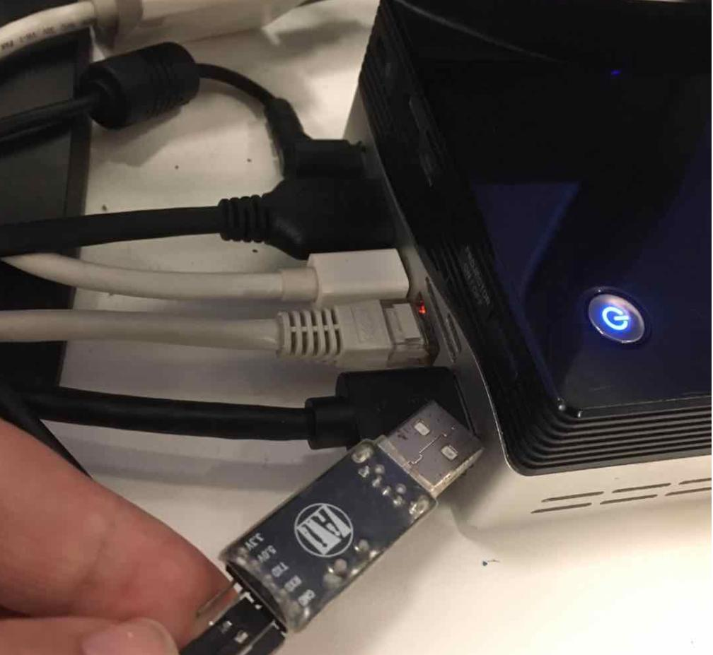
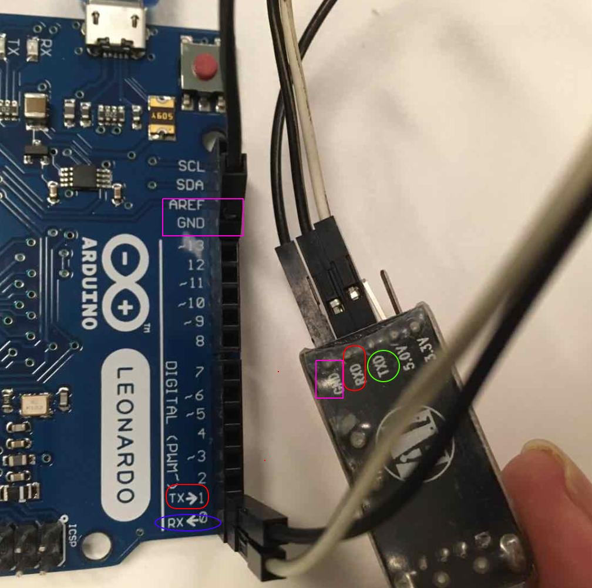
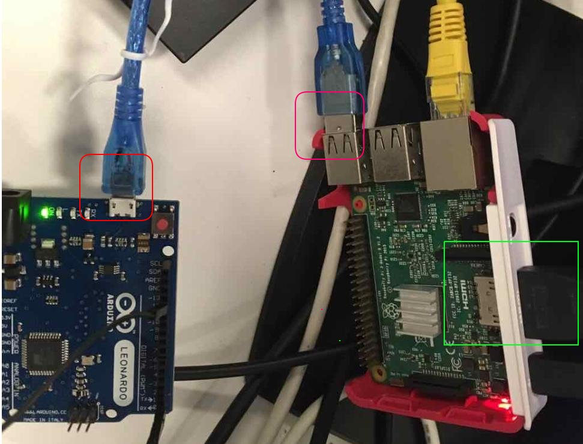
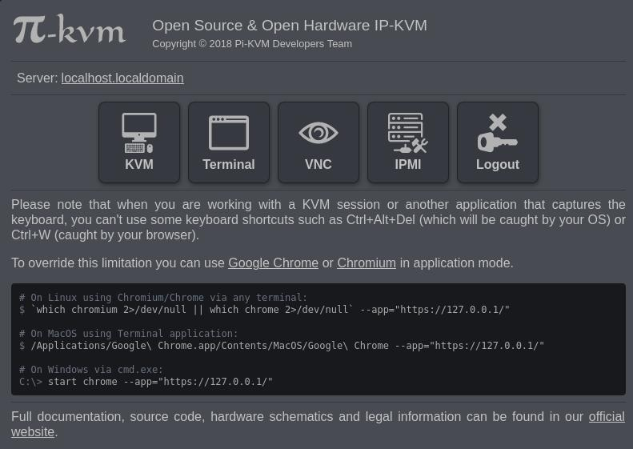
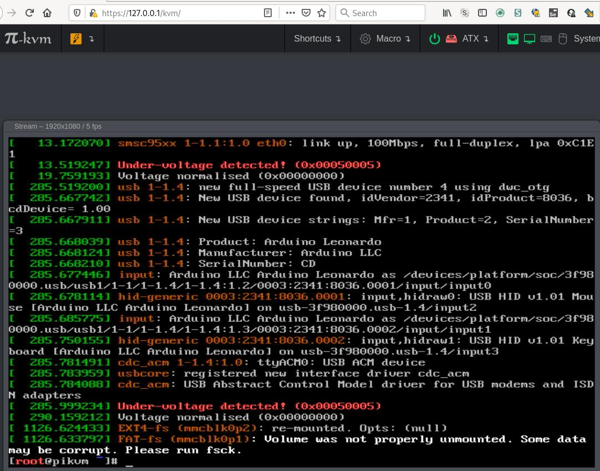
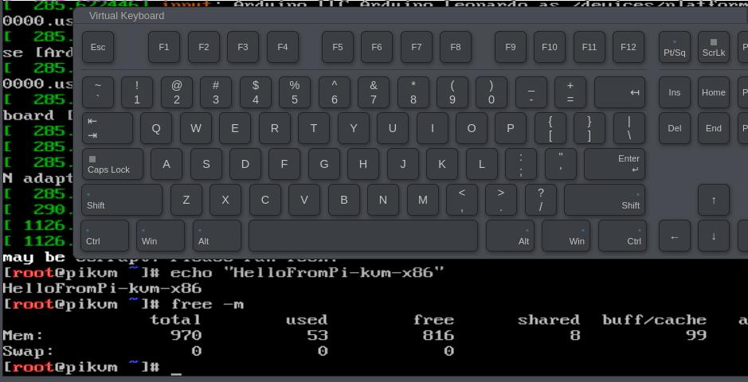
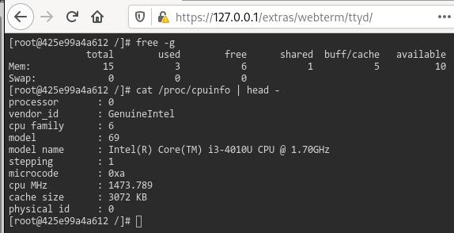

# Pi-KVM on X86

### What is `Pi-KVM on X86`
Run [Pi-KVM](https://github.com/pikvm) on x86 platform using [docker](http://www.docker.com).

### Why
* Cost-Saving(HDMI-USB Dongle + Arduino Leonard + USB-TTL is enough).
* One-line for starting up. 
* Could run both on Physical-Server Or VMs.
* May support more poweful Dongle(which support 4K?). 

### Building Components
|                  Hardware/Price| Reference URL|
|--------------------------|-----------|
|               HDMI-USB Dongle/35 RMB/USD 4.61,| [Taobao Link](https://item.taobao.com/item.htm?spm=a1z09.2.0.0.6eab2e8dKQmeGU&id=619294316849&_u=5mm2aq95e70) |
|               Arduino Leonard R3/26 RMB/USD 3.74| [Taobao Link](https://item.taobao.com/item.htm?spm=a1z09.2.0.0.6eab2e8dKQmeGU&id=586434235953&_u=5mm2aq9da0c) |
|                 USB-TTL PL2303/3.1 RMB/USD 0.45 | [Taobao Link](https://item.taobao.com/item.htm?spm=a230r.1.14.45.68342e113ebu59&id=534917547321&ns=1&abbucket=12#detail) |
|                    HDMI Line/7 RMB/USD 1  | No Link |

### Preparation
Flash Arduino :   
[https://github.com/pikvm/pikvm/blob/master/pages/flashing_hid.md](https://github.com/pikvm/pikvm/blob/master/pages/flashing_hid.md)   

Install Docker on your own x86 machine:    
Take Ubuntu for example:  
[https://docs.docker.com/engine/install/ubuntu/](https://docs.docker.com/engine/install/ubuntu/)
Or if you are using ArchLinux: `sudo pacman -S docker --noconfirm`

Check docker installation.   
```
sudo docker version
Client:
 Version:           19.03.11-ce
...
Server:
 Engine:
  Version:          19.03.11-ce
...
```
### Building Steps
#### Hardware
1. Insert USB Dongle into NUC:   

   

Your Linux machine `dmesg` output: 
```
[31359.458026] usb 2-2: new high-speed USB device number 10 using xhci_hcd
[31359.601274] usb 2-2: New USB device found, idVendor=534d, idProduct=2109, bcdDevice=21.00
[31359.601281] usb 2-2: New USB device strings: Mfr=1, Product=0, SerialNumber=0
[31359.601284] usb 2-2: Manufacturer: MACROSILICON
[31359.602611] uvcvideo: Found UVC 1.00 device <unnamed> (534d:2109)
[31359.603462] uvcvideo 2-2:1.0: Entity type for entity Processing 2 was not initialized!
[31359.603468] uvcvideo 2-2:1.0: Entity type for entity Camera 1 was not initialized!
[31359.608494] hid-generic 0003:534D:2109.0008: hiddev2,hidraw3: USB HID v1.10 Device [MACROSILICON] on usb-0000:00:14.0-2/input4
```
2. Insert USB-TTL into NUC:   



Your Linux `dmesg` output:    

```
[31542.623993] usb 2-3.3: new full-speed USB device number 11 using xhci_hcd
[31542.717407] usb 2-3.3: New USB device found, idVendor=067b, idProduct=2303, bcdDevice= 3.00
[31542.717411] usb 2-3.3: New USB device strings: Mfr=1, Product=2, SerialNumber=0
[31542.717413] usb 2-3.3: Product: USB-Serial Controller
[31542.717414] usb 2-3.3: Manufacturer: Prolific Technology Inc.
[31542.724760] pl2303 2-3.3:1.0: pl2303 converter detected
[31542.725971] usb 2-3.3: pl2303 converter now attached to ttyUSB0
```

3. USB-TTL to Arduino Leonardo:   

   

4. Remote-machine(RPI3) :



#### Software
Pull back the docker images:    

```
$ sudo docker pull feipyang/kvmdx86:20200805
$ sudo docker images | grep kvmdx86
feipyang/kvmdx86                                     20200805            f575b0e5f207        21 minutes ago      697MB
```
Run docker instance:    

```
$ sudo docker run -d -p443:443 -p80:80 --device=/dev/ttyUSB0:/dev/kvmd-hid --device=/dev/video0:/dev/kvmd-video feipyang/kvmdx86:20200805
425e99a4a61223530f0544b2c805ba7147c58aea001c430beb68b0710c743384
$ sudo docker ps
CONTAINER ID        IMAGE                       COMMAND                  CREATED             STATUS              PORTS                                      NAMES
425e99a4a612        feipyang/kvmdx86:20200805   "/usr/bin/supervisor…"   19 seconds ago      Up 17 seconds       0.0.0.0:80->80/tcp, 0.0.0.0:443->443/tcp   boring_davinci

```
Now using firefox or chromium open `https://127.0.0.1`, you get the pi-kvm webpage. 

    

Using `admin/admin` for login:    



Click `KVM` for viewing the pi's output:    



Test keyboard(physical or virtual):    

    

Go back to see `Terminal`:   

   

Checking log:    

```
sudo docker logs -f 425e99a4a612 | more
2020-08-05 09:31:37,846 CRIT Supervisor is running as root.  Privileges were not dropped because no user is specified in the config file.  If you intend to run as root, you can set user=root
 in the config file to avoid this message.
2020-08-05 09:31:37,851 INFO supervisord started with pid 1
2020-08-05 09:31:38,855 INFO spawned: 'kvmd' with pid 8
2020-08-05 09:31:38,860 INFO spawned: 'kvmd-nginx' with pid 9
2020-08-05 09:31:38,863 INFO spawned: 'runpriledge' with pid 10
2020-08-05 09:31:38,867 INFO spawned: 'ttyd' with pid 11
kvmd.apps.kvmd                    INFO --- Using internal auth service 'htpasswd'
kvmd.keyboard.keysym              INFO --- Reading keyboard layout /usr/share/kvmd/keymaps/en-us ...
kvmd.plugins.hid.serial           INFO --- Starting HID daemon ...
kvmd.plugins.hid.serial           INFO --- Started HID pid=18
kvmd.apps.kvmd.streamer           INFO --- Installing SIGUSR2 streamer handler ...
kvmd.apps.kvmd.http               INFO --- ======== Running on http://unix:/run/kvmd/kvmd.sock: ========
...
```
### Things to be done
1. Log could not be shown on webpage
2. Need do more testing on different Linux distribution. 
3. Using it in vm(virtualbox/kvm/vmware, etc)
